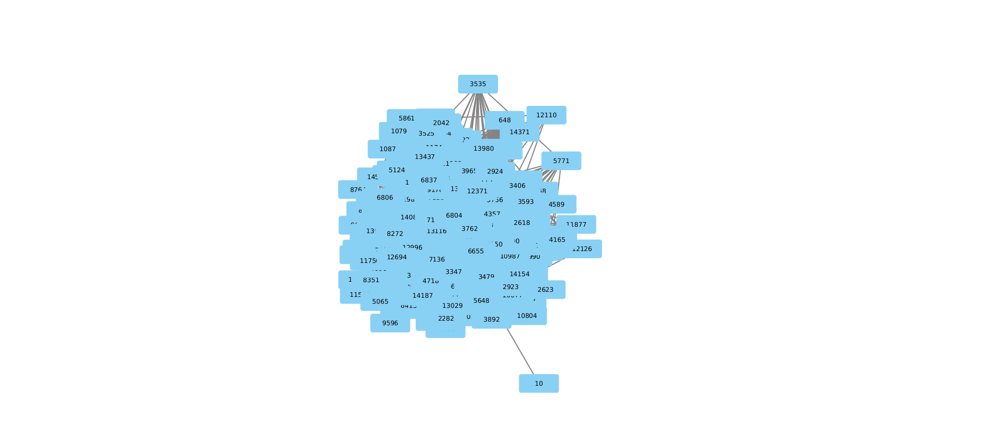
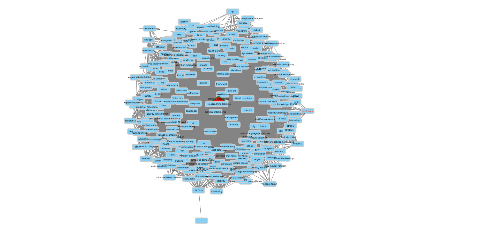

# Socialinių medijų analitika
## Laboratorinis darbas 7: Cytoscape naudojimas tinklo analizei
## Darbą atliko: Paulius Lapienis

# Užduotis

Cytoscape aplinkoje atlikti tinklo analizę suskaičiuojant ir naudojant tinklo 
parametrus.

# Darbo eiga
## Tinklo importavimas į Cytoscape

Analizei pasirinktas paskaitų medžiagoje pateiktas tinklas ai (iš failų 
"ai_soft_map.csv" ir "ai_soft_net.csv"). 
Importavus tinklą į Cytoscape, matoma standartinė vizualizacija.

{width=100%}

## Atributų vizualizacija

Pirmiausiai su Cytoscape buvo suskaičiuojami tinklo atributai naudojant Tools 
> Analyze Networks. Po šios analizės keturi tinklo atributai: "Degree", 
"Betweennes Centrality", "Closiness Centrality" ir "Topological coefficient"
išskirti vizualiai pažymint mazgą kuris turi didžiausią reikšmę.

Didžiausią "Degree" turintis mazgo fonas nuspalvintas raudonai, 
didžiausią "Betweennes Centrality" turintis mazgo fonas nuspalvintas žaliai,
didžiausią "Topological Coeficient" turintis mazgo tekstas nuspalvintas 
raudonai, didžiausią "Closiness Centrality" turintis mazgas išskirtas trikampio
 forma.

Matoma, kad išskirti du mazgai, sars-cov-2 (kairėje, raudonas tekstas), bei
artificial intelligence (išskirtas pagal likusius atributus). Iš to galime 
teigti, jog šie mazgai, svarbiausi tinkle.

\pagebreak
