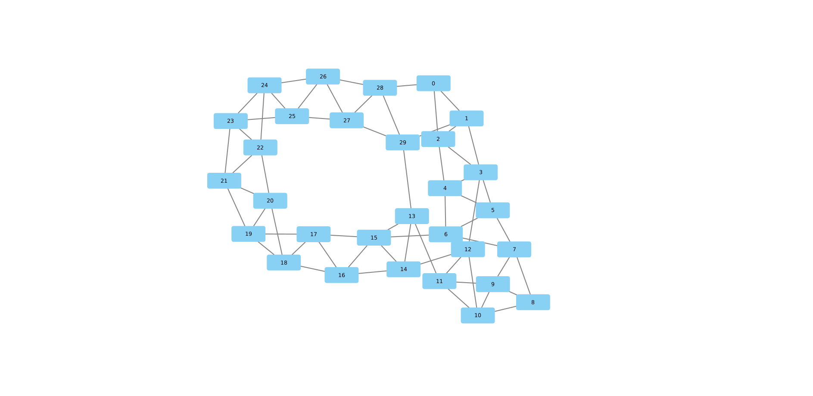
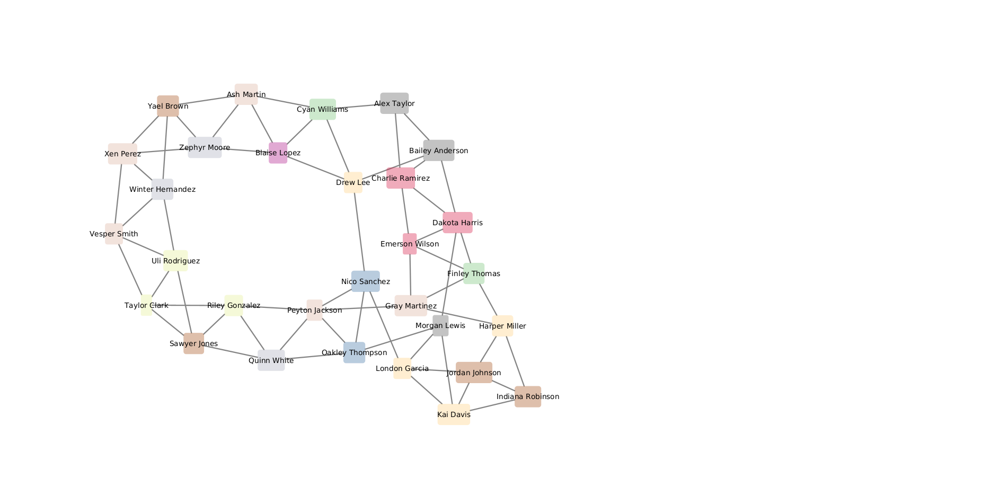

# Social Media Analytics
## Lab work no. 4: Learning Cytoscape through a toy example
## Made by: Paulius Lapienis

# Visualizations
## Default
{width=100%}

## Visualizing attributes
For the attribute visualisation a discrete and continous attributes were chosen.
For continous - age was chosen and the width of the nodes was selected.
For discrete - the city was chosen and the color was set.
Nodes were also named with names not node ids.

\pagebreak

# Appendix
## Data
### Edge table

|source|target|
|------|------|
|0     |1     |
|0     |2     |
|0     |28    |
|1     |2     |
|1     |3     |
|1     |29    |
|2     |3     |
|2     |4     |
|3     |4     |
|3     |5     |
|3     |12    |
|4     |5     |
|4     |6     |
|5     |6     |
|5     |7     |
|6     |7     |
|6     |15    |
|7     |8     |
|7     |9     |
|8     |9     |
|8     |10    |
|9     |10    |
|9     |11    |
|10    |11    |
|10    |12    |
|11    |12    |
|11    |13    |
|12    |14    |
|13    |14    |
|13    |15    |
|13    |29    |
|14    |15    |
|14    |16    |
|15    |16    |
|15    |17    |
|16    |17    |
|16    |18    |
|17    |18    |
|17    |19    |
|18    |19    |
|18    |20    |
|19    |20    |
|19    |21    |
|20    |21    |
|20    |22    |
|21    |22    |
|21    |23    |
|22    |23    |
|22    |24    |
|23    |24    |
|23    |25    |
|24    |25    |
|24    |26    |
|25    |26    |
|25    |27    |
|26    |27    |
|26    |28    |
|27    |28    |
|27    |29    |
|28    |29    |

### Node table

|node|age|gender|city    |name            |
|----|---|------|--------|----------------|
|0   |45 |Male  |Toronto |Alex Taylor     |
|1   |49 |Male  |Toronto |Bailey Anderson |
|2   |45 |Male  |Sydney  |Charlie Ramirez |
|3   |47 |Female|Sydney  |Dakota Harris   |
|4   |23 |Other |Sydney  |Emerson Wilson  |
|5   |34 |Other |Berlin  |Finley Thomas   |
|6   |51 |Other |London  |Gray Martinez   |
|7   |34 |Female|Moscow  |Harper Miller   |
|8   |42 |Female|Tokyo   |Indiana Robinson|
|9   |57 |Female|Tokyo   |Jordan Johnson  |
|10  |51 |Female|Moscow  |Kai Davis       |
|11  |29 |Male  |Moscow  |London Garcia   |
|12  |26 |Other |Toronto |Morgan Lewis    |
|13  |45 |Female|New York|Nico Sanchez    |
|14  |35 |Female|New York|Oakley Thompson |
|15  |26 |Other |London  |Peyton Jackson  |
|16  |43 |Male  |Dubai   |Quinn White     |
|17  |30 |Male  |Mumbai  |Riley Gonzalez  |
|18  |33 |Female|Tokyo   |Sawyer Jones    |
|19  |19 |Other |Mumbai  |Taylor Clark    |
|20  |39 |Female|Mumbai  |Uli Rodriguez   |
|21  |29 |Male  |London  |Vesper Smith    |
|22  |35 |Female|Dubai   |Winter Hernandez|
|23  |46 |Male  |London  |Xen Perez       |
|24  |35 |Male  |Tokyo   |Yael Brown      |
|25  |53 |Other |Dubai   |Zephyr Moore    |
|26  |37 |Female|London  |Ash Martin      |
|27  |30 |Male  |Paris   |Blaise Lopez    |
|28  |42 |Female|Berlin  |Cyan Williams   |
|29  |30 |Female|Moscow  |Drew Lee        |
